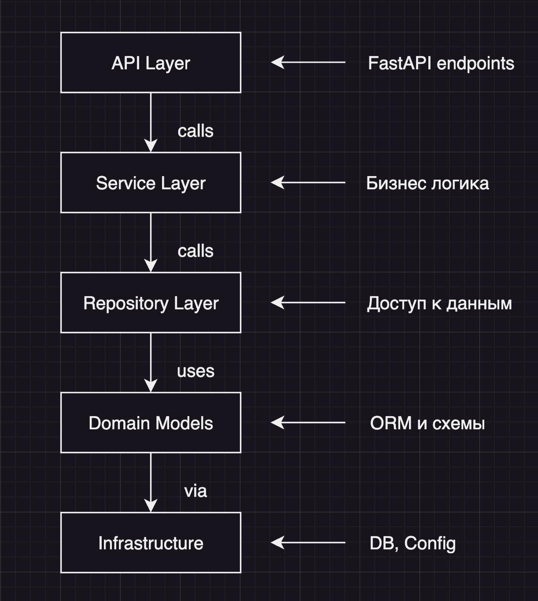

## 🧩 Уровни абстракции проекта

| Уровень | Назначение | Примеры файлов / директорий |
|----------|-------------|-----------------------------|
| **1. Presentation (внешний интерфейс, API)** | Отвечает за приём/возврат данных пользователю (HTTP-запросы, WebSocket, REST API). Не знает, как хранятся данные. | `app/api/v1.py`, `app/api/routers/`, `app/api/deps.py`, `app/ws/` |
| **2. Service (бизнес-логика / use cases)** | Содержит бизнес-логику: как система работает, какие данные обрабатывает, какие правила действуют. Вызывает репозитории, но не знает про SQL. | `app/service/robot_service.py` |
| **3. Repository / Data Access Layer (DAL)** | Отвечает за конкретный доступ к данным. Здесь находятся SQL-запросы или ORM-взаимодействие (SQLAlchemy). | `app/repositories/robot_repo.py` |
| **4. Domain (модель данных / схемы)** | Содержит описание сущностей (таблицы в БД и Pydantic-схемы). Не знает, как они используются — только структура. | SQLAlchemy модели: `app/db/models/robot.py`  Pydantic схемы: `app/schemas/robot.py` |
| **5. Infrastructure (инфраструктура и настройки)** | Отвечает за внешние зависимости: база данных, конфигурации, миграции, логирование. | `app/db/base.py`, `app/db/session.py`, `app/core/config.py`, `app/core/logging.py`, `alembic/` |
| **6. Entry point / Composition Root** | Точка входа, которая всё собирает: создаёт FastAPI-приложение, подключает маршруты, зависимости и настройки. | `app/main.py` |
| **7. Deployment / DevOps уровень** | Не часть бизнес-кода, но важен для развёртывания и среды. | `Dockerfile`, `docker-compose.yml`, `.env`, `.gitignore`, `pyproject.toml` |

